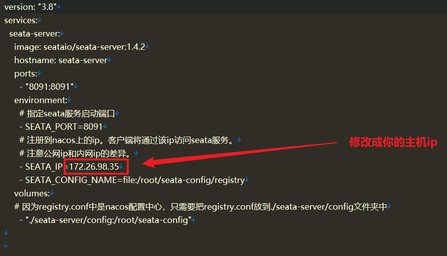
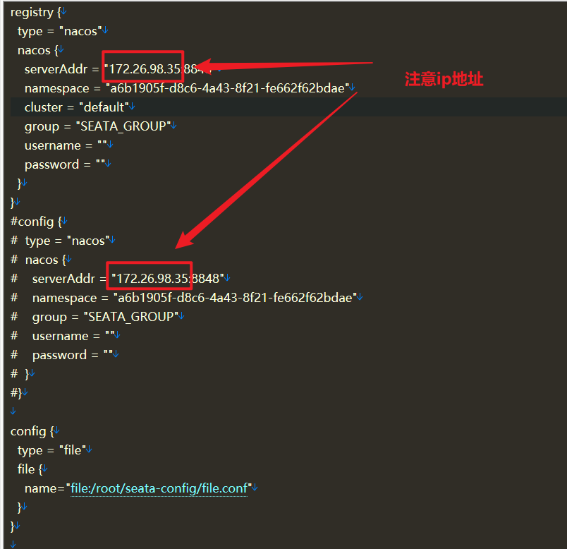
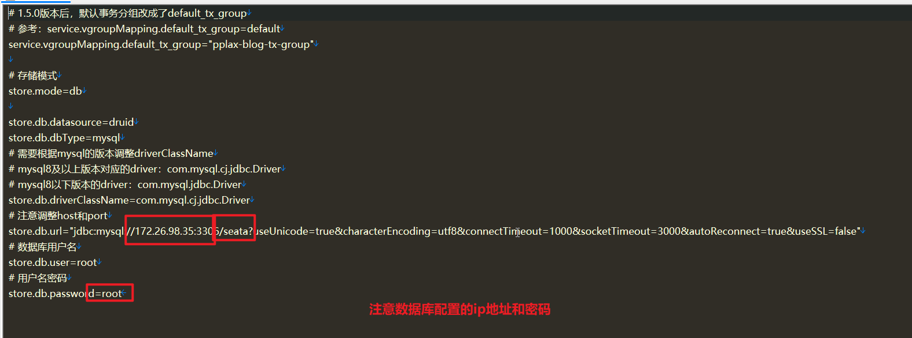
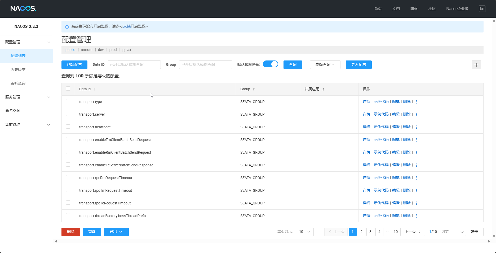
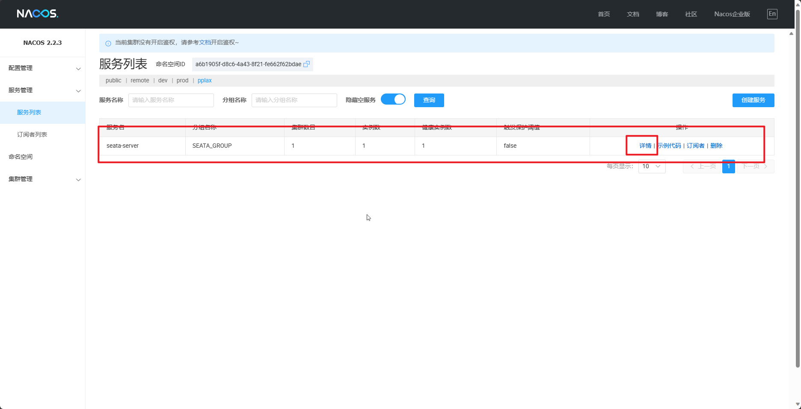
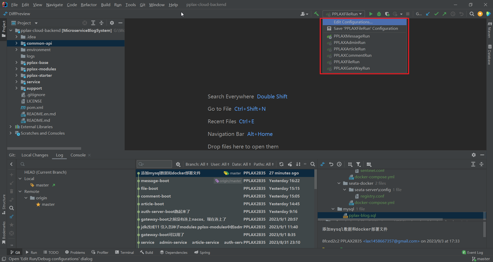
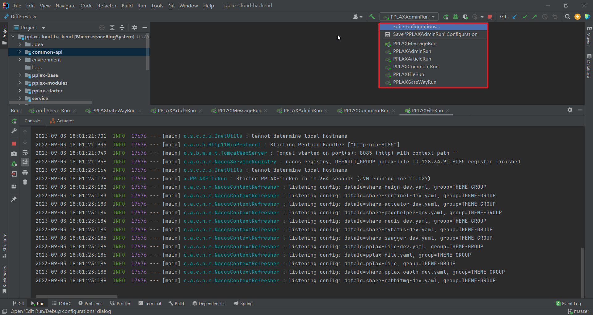
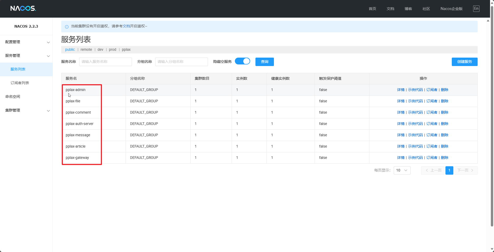
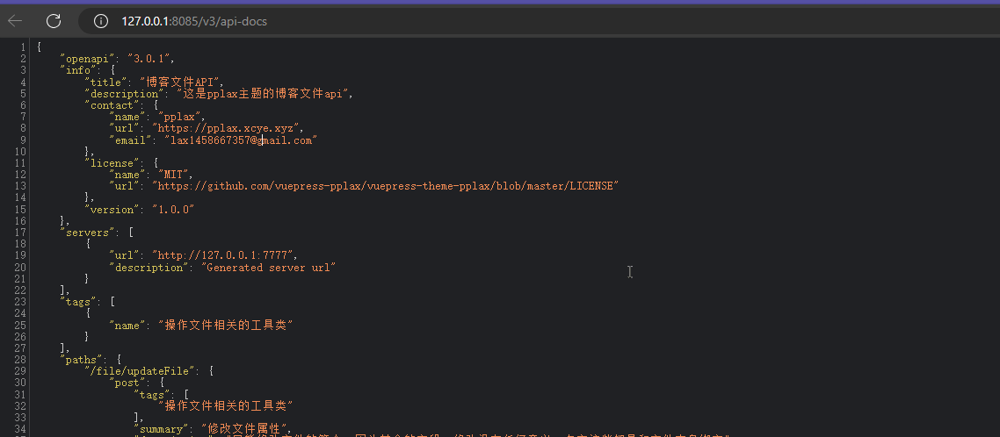

# pplax-cloud-backend

#### 介绍

springcloud博客后端

‍

#### 环境搭建

Docker

docker-compose

java11

##### nacos-mysql8

[nacos-mysql-docker.7z](assets/nacos-mysql-docker-20230903174538-xpzibp8.7z)

在`/nacos-mysql-docker`​目录中执行如下命令启动

```bash
docker-compose -f example/standalone-mysql-8.yaml up
```

如果之前没有安装mysql8，nacos启动时会报错

将以下数据库脚本导入，重新执行命令即可

[pplax.blog.sql](assets/pplax.blog-20230918160640-feohkzv.sql)

‍

##### seata-docker

[seata-docker.7z](assets/seata-docker-20230918104149-no2zy9o.7z)

​`/seata-docker/docker-compose.yml`​的配置如下

​​​​

​`/seata-server/config/registry.conf`​的配置如下

​​​

​`/seata-server/config/file.conf`​的配置如下

​​​

这个file.conf文件需要拷贝到容器内

```bash
docker cp file.conf seata-docker_seata-server_1:/root/seata-config/
```

启动命令

```bash
docker-compose -f docker-compose.yml up
```

‍

##### redis-sentinel-docker

[redis-sentinel-docker.7z](assets/redis-sentinel-docker-20230903175612-tvr0z7u.7z)

启动命令

```bash
docker-compose -f docker-compose.yml up
```

##### RabbitMQ-docker

[RabbitMQ-docker.7z](assets/RabbitMQ-docker-20230903175711-tvclprn.7z)

启动命令

```bash
docker-compose -f docker-compose.yml up
```

以上都启动后，访问[http://127.0.0.1:8848/nacos](http://127.0.0.1:8848/nacos)

​​

​​

​​

‍

​​

​​

‍

#### 启动

这几个都启动起来就行了

​​

​​

‍

#### swagger

访问地址

[Swagger UI](http://localhost:8080/webjars/swagger-ui/index.html)

​​
