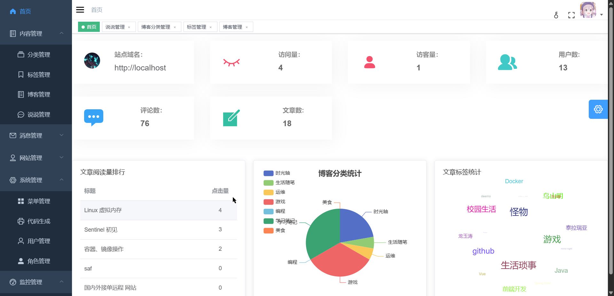
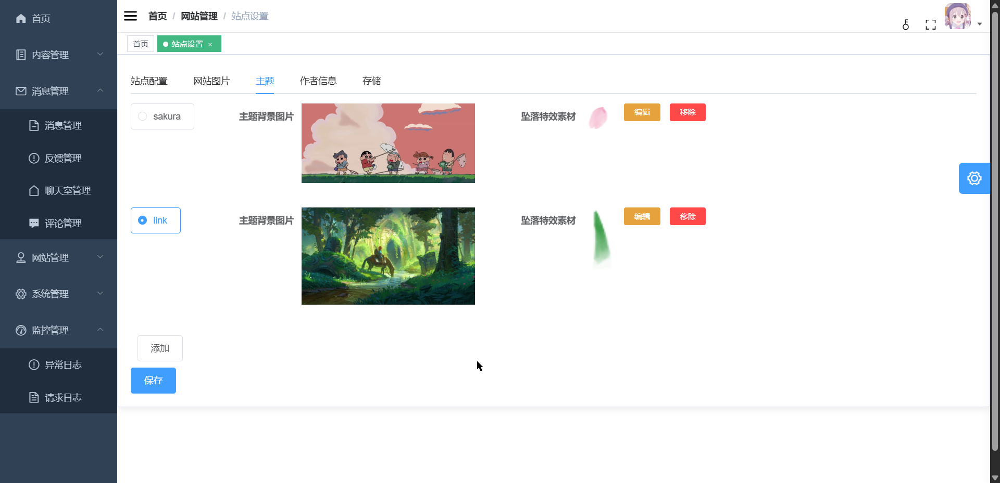
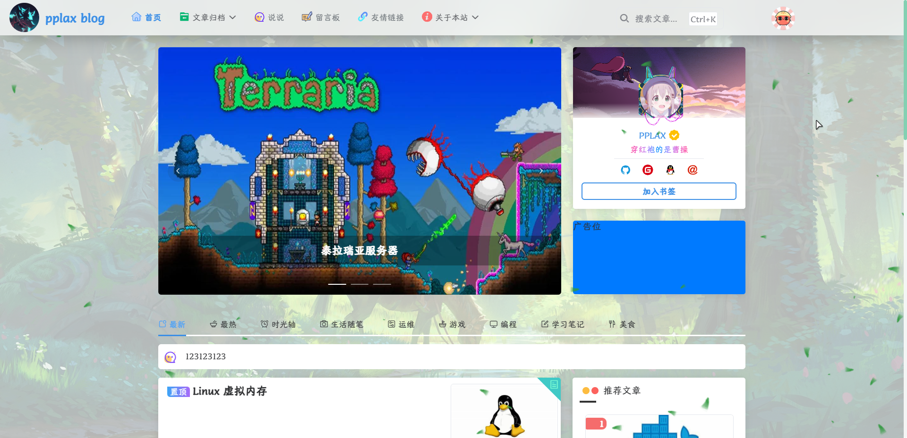
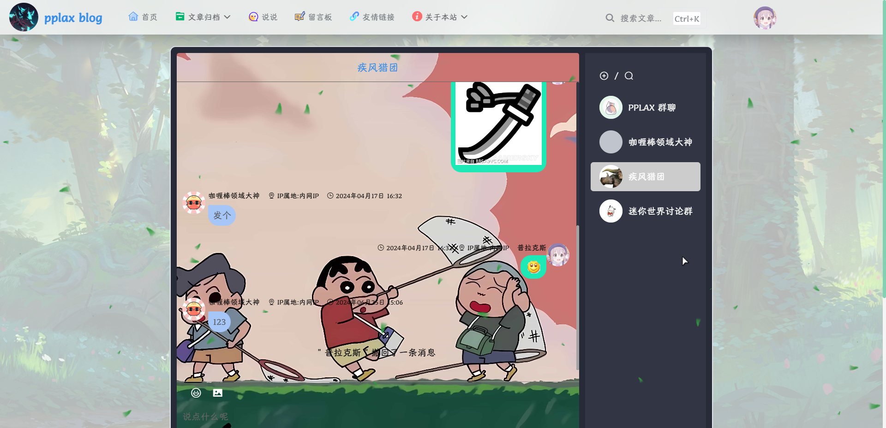
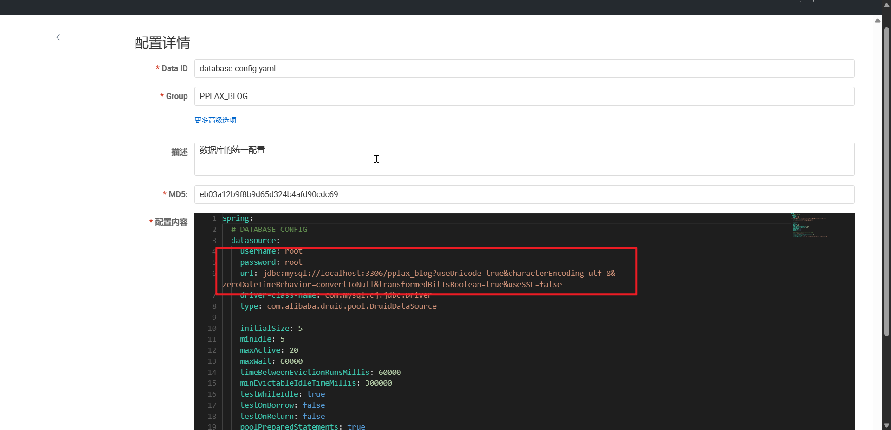
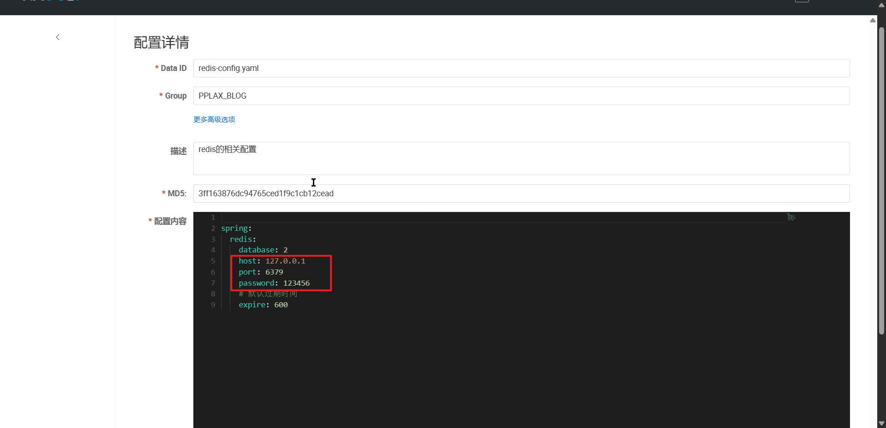
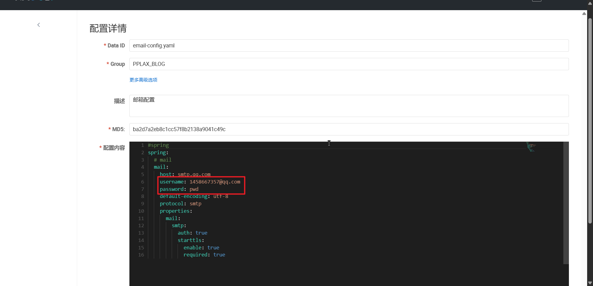

# PPLAX-Blog

个人开发的一个博客项目，因为看见别人的博客项目，就觉得很厉害，然后自己也想整一个（当前部署不了，租的服务器太拉...）

目前做到了`Spring Gateway + Oauth2的统一登录认证`​、`权限及菜单动态分配`​、`mysql与缓存相关的优化`​、`统一异常处理`​、`消息队列对评论等相关数据的处理`​、`restful风格的api`​、`代码生成`​、`请求日志和异常日志监控`​、`前台动态主题`​、`websocket聊天室`​等

## 页面图片

后台

​​

​​

前台

​​

​​

就展示这点吧

## 用到的技术

### 后端

​`Spring Cloud Alibaba`​ `Spring Boot`​  `My batis-plus`​ `Spring Security Oauth2`​ `Spring Cloud Gateway`​ `druid`​ 等等吧

主要参考了

[蘑菇博客: 蘑菇博客(MoguBlog)，一个基于微服务架构的前后端分离博客系统。Web端使用Vue + Element , 移动端使用uniapp和ColorUI。后端使用Spring cloud + Spring boot + mybatis-plus进行开发，使用 Jwt + Spring Security做登录验证和权限校验，使用ElasticSearch和Solr作为全文检索服务，使用Github Actions完成博客的持续集成，使用ELK收集博客日志，文件支持上传七牛云和Minio，支持Docker Compose脚本一键部署。 (gitee.com)](https://gitee.com/moxi159753/mogu_blog_v2)

[RuoYi-Cloud: 🎉 基于Spring Boot、Spring Cloud &amp; Alibaba的分布式微服务架构权限管理系统，同时提供了 Vue3 的版本 (gitee.com)](https://gitee.com/y_project/RuoYi-Cloud)

[GitHub - xcyeye/aurora-blog: 🔥Aurora博客是一个基于Spring Cloud Alibaba的多人微服务博客项目，前台和后台界面非常漂亮，特征：邮箱链接验证、账户锁定等邮件功能。前端技术：TypeScript + Vue3 + Pinia + NaiveUi，后端技术：Spring Cloud Alibaba + RabbitMq + Seata + Oauth2。](https://github.com/xcyeye/aurora-blog)

等大佬的项目

### 前端

​`vue2`​ `element-ui`​

前台使用了[拾壹博客: 一款vue+springboot前后端分离的博客系统，博客后台管理系统使用了vue+elmentui开发，后端使用Sa-Token进行权限管理,支持动态菜单权限，动态定时任务，文件支持本地和七牛云上传，使用ElasticSearch作为全文检索服务，支持QQ、微信公众号扫码、码云、GitHub登录。实现即时通讯聊天室功能 (gitee.com)](https://gitee.com/quequnlong/shiyi-blog)的前台项目（非常感谢）

‍

## 如何跑起来

### 环境

 `nodejs 12.22.12`​ `Java 8`​ `Maven3.8.8`​

### 中间件

​`MySQL 8`​ `rabbitmq 3.9.1`​ `nacos-server 2.2.0`​ `minio`​ `redis`​

### 需要调整的配置

访问nacos面板，红框中的需要改成自己的

​​

​​

​​

​​

‍
